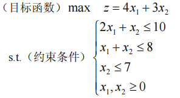
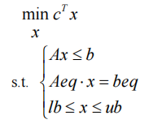

# 线性规划

前提条件：`有约束最优化问题`

线性规划(Linear Programming 简记 LP)问题是在一组线性约束条件的限制下，求一线性目标函数最大或最小的问题。

目标函数及约束条件均为线性函数，故被称为线性规划问题。

规划问题的数学模型的**三要素**：

1. 决策变量：问题中要确定的未知量；
2. 目标函数：决策变量的函数，优化目标通常是求该函数的最大值或最小值；
3. 约束条件：决策变量取值所受到的约束和限制条件（一组含有决策变量的线性等式或不等式）。

## 线性规划的Matlab标准形式

$c$ 和 $x$ 为 $n$ 维列向量，
$A$ 、 $Aeq$ 为适当维数的矩阵，
$b$ 、$beq$ 为适当维数的列向量。

