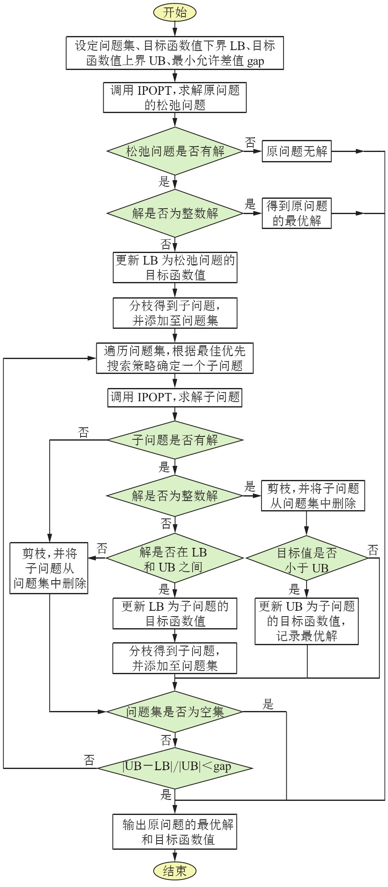

# 整数规划

## 分支定界法

常被用于求解纯整数规划问题和混合整数规划问题，该方法围绕一棵搜索树，通过对原问题进行多层次分解产生一系列子问题（分枝），直到子问题对应的松弛问题的最优解中原整数变量的值均为整数为止。

由于原问题的最优解一定优于或等于其各子问题的最优解，因此若搜索过程中某个子问题无可行解，或该子问题的最优解不比当前获得的最好解更优，则算法能够获得启发性信息，即原问题的最优解不能从这一分支找到，应当将这一分支从搜索树中删去，即使剪去的分支还能够再拆分出子问题，也不再进行分枝，这样可以缩小算法的搜索范围，提高算法的搜索效率。

若当前所有的树叶节点都不能再进行分枝时，当前最优解即为原问题最优解。

内点法是求解非线性规划问题的有效方法，屏障内点法和原始-对偶内点法是两种最为经典的内点法。

- 屏障内点法的基本思路是构造惩罚函数，将带约束的非线性规划问题转化为一系列的无约束非线性规划问题，在可行域边界筑起 “围墙” ，防止迭代点落到可行域的外面，同时采用逐渐增大惩罚力度的方法提高算法求解的稳定性。

- 原始-对偶内点法则借助扰动 KKT 条件求解新的迭代点，相比屏障内点法具有更好的精度和的效率。原始-对偶内点法能够高效求解大规模的非线性规划模型，但不能直接求解含开机台数等整数变量的输气管网稳态运行方案优化模型。

根据所建数学模型的特点，提出分枝定界法与原始-对偶内点法耦合的求解方法（简称“分枝定界-内点法”），该算法的基本思路（图2）为：

1. 对数学模型进行松弛处理，即删除混合整数规划问题中的整数变量约束条件；
2. 应用适用于非线性规划问题的内点法求解原问题及其分支问题的松弛问题；
3. 以松弛问题最优解中某个不满足整数约束的决策变量的值作为分支点，采用伪费用分枝法与强分枝法结合的混合分枝法构造新的分支问题；
4. 基于最佳优先搜索策略将分支问题不断划分为多个下一级子问题，重复步骤1～3。

