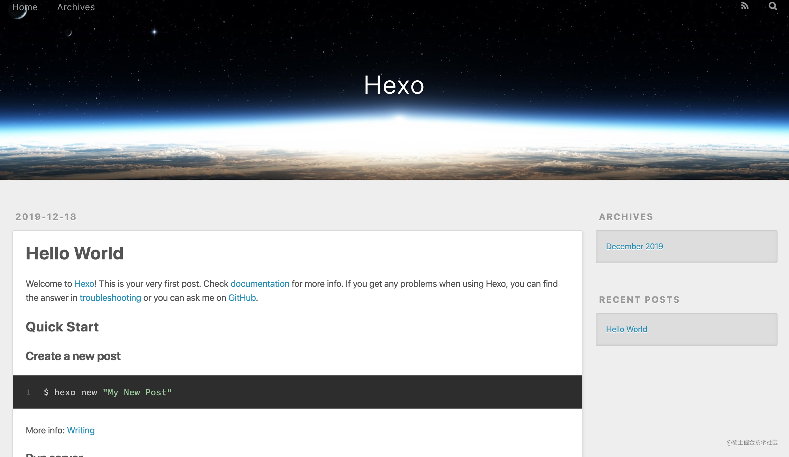
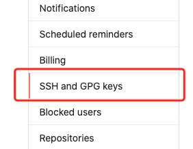
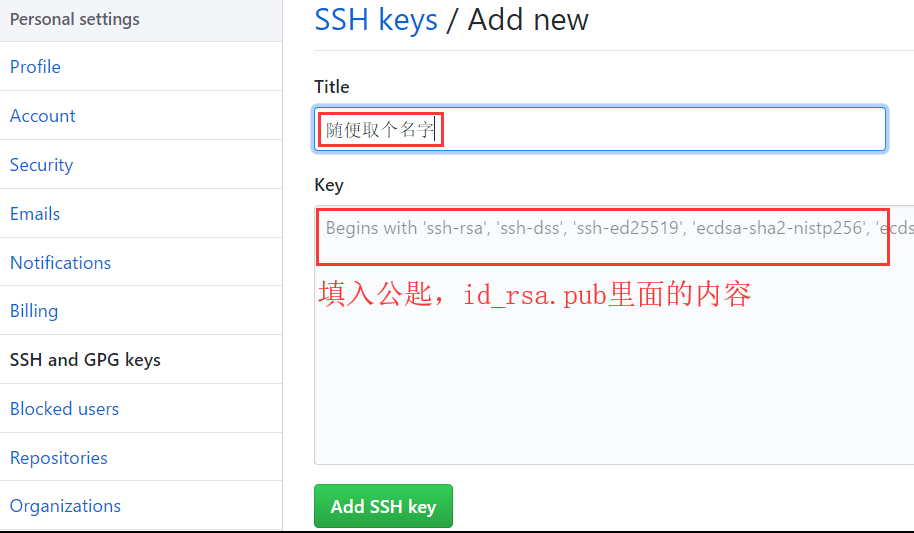
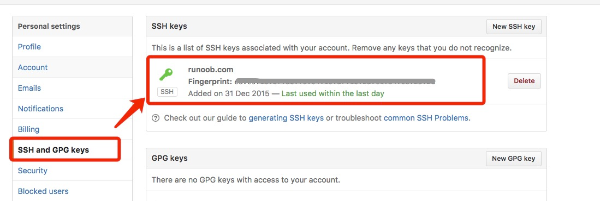
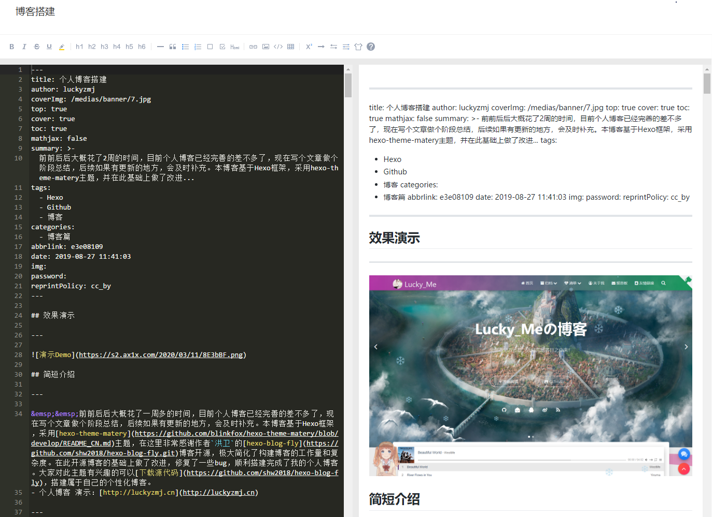
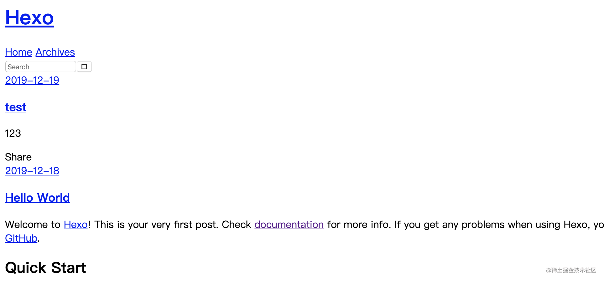
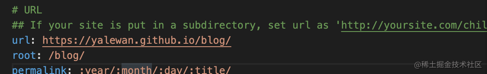

# GitHub Page + Hexo 框架搭建博客网站

## 环境准备

安装 [Git](https://gitforwindows.org/) 和 [Node.js](https://nodejs.org/zh-cn/download/) 并注册 [Github](https://github.com)

安装成功检验：

- 在命令行执行下列命令：

```css
$ git --version
git version 2.9.0.windows.1
$ node --version
v10.15.3
$ npm --version
6.4.1
```

## 安装Git

`Git`是目前世界上最先进的分布式版本控制系统，可以有效、高速的处理从很小到非常大的项目版本管理。`Git`的作用是**将本地的网页文件传到**`**github**`**上**。

- Git[下载地址]：([https://git-scm.com/](https://git-scm.com/))

官网慢，可以用国内的镜像：([https://npm.taobao.org/mirrors/git-for-windows/](https://npm.taobao.org/mirrors/git-for-windows/))

- Git[教程]：([https://www.liaoxuefeng.com/wiki/896043488029600](https://www.liaoxuefeng.com/wiki/896043488029600))

Git常用命令：
1)、cd：改变目录。
2)、cd ..：回退到上一个目录，直接cd进入默认目录。
3)、pwd：显示当前所在的目录路径。
4)、ls(||)：都是列出当前目录中的所有文件，只不过||(两个||)列出的内容更为详细。蓝色为目录，绿色为程序，白色为文件。
5)、mkdir：新建一个目录，就是新建一个文件夹。
6)、clear：清屏。Windows操作系统下为cls。

> 工作流程

```git
#把代码放到工作目录下

#把代码添加到暂存区
git add .

#查看文件状态，是否被添加到暂存区
git status

#提交到本地
git commit -m "消息内容"

#查看文件状态，是否被提交到本地
git status

#提交到远程仓库
git push
```

**windows：** 到git官网上下载.exe文件, Download git,安装选项还是全部默认，最后一步添加路径时选择`Use Git from the Windows Command Prompt`。

## 安装Node.js

`Hexo`是基于`Node.js`编写的，所以需要安装`node.js`和里面的`npm`工具。

- Node.js[下载地址]：([https://nodejs.org/zh-cn/download/](https://nodejs.org/zh-cn/download/))

这个安装包里面包括两个组件，一个是`node.js`本身，另一个是`npm`包管理器。

**windows：**到 Node.js 官网下载`.exe`文件，安装选项全部默认。安装好之后，按`Win+R`打开cmd命令提示符，输入`node -v`和`npm -v`，若出现版本号，则说明安装成功。

## 添加npm国内源

由于国内的官网访问速度很慢，所以我们一般在使用之前利用`npm`安装一个`cnpm`淘宝镜像源。

使用阿里的国内镜像进行加速下载
`npm config set registry https://registry.npm.taobao.org`

> windows要配置cnpm环境变量
> [win10安装nodejs及配置cnpm详细教程](https://blog.csdn.net/qq_44697728/article/details/114276438)

## 安装Hexo

前面`git`和`nodejs`安装完成后，就可以安装`hexo`了。

首先，你可以先创建一个文件夹`MyBlog`，用来存放自己的博客文件。

然后`cd`到这个文件夹下（或者在这个文件夹下直接右键`git bash`打开）。

> 比如我的博客文件都存放在`E:\MyBlog`目录下。
> 在该目录下右键点击`Git Bash Here`，打开`git`的控制台窗口，以后我们所有的操作都在`git`控制台进行，就不用`Windows`自带的`cmd`了。

定位到该目录下，输入`npm install --location=global hexo-cli`安装`Hexo`。可能会有几个报错，不用理会。

安装成功后输入`hexo -v`验证是否安装成功。

到此为止`hexo`就安装完了。

## 安装hexo-server

由于现在hexo 和 hexo-server 分离开了，如果想本地起服务的话需要安装hexo-server

- npm i hexo-server -S
- 接着输入hexo g生成静态文件
- hexo s开启服务器，正式体验Hexo


访问localhost:4000出现上图所示代表成功了，如果页面一直无法跳转，那么可能端口被占用了。

- 输入hexo server -p 端口号来改变端口号

## 初始化博客

接下来初始化一下`hexo`,即初始化我们的网站，输入`hexo init`初始化文件夹

新建完成后，指定文件夹`MyBlog`目录下有：

- `node_modules`: 依赖包
- `public`：存放生成的页面
- `scaffolds`：生成文章的一些模板
- `source`：用来存放你的文章
- `themes`：主题**
- `_config.yml`: 博客的配置文件**

到此为止，本地的网站配置完成了。

输入`hexo g`生成静态网页，然后输入`hexo s`打开本地服务器

```git
hexo g
hexo s
```

---

## 部署到服务器

### 注册Github账号创建个人仓库

接下来就去注册一个`github`账号，用来存放我们的网站。

打开`github`([https://github.com/](https://github.com/))，新建一个项目仓库`New repository`；

然后如下图所示，输入自己的项目名字，后面一定要加`.github.io`后缀，README初始化也要勾上；

> 要创建一个和你用户名相同的仓库，后面加`.github.io`，只有这样，将来要部署到`GitHub page`的时候，才会被识别，也就是`http://xxxx.github.io`，其中xxx就是你注册`GitHub`的用户名。例如我的：`http://LuckyZmj.github.io`

在博客根目录下右键打开`git bash here`，安装一个扩展`npm i hexo-deployer-git`。

```git
cnpm install hexo-deployer-git
```

## 生成SSH添加到GitHub

生成`SSH`添加到`GitHub`，连接`Github`与本地。

右键打开`git bash here`，然后输入下面命令：

```git
git config --global user.name "注册GitHub用户名"
git config --global user.email "注册GitHub的邮箱"
```

用以下两条，检查一下你有没有输对

```git
git config user.name
git config user.email
```

然后创建`SSH`,一路回车

```git
 "注册GitHub的邮箱"
```

这个时候它会告诉你已经生成了`.ssh`的文件夹。

进入本地 .ssh 文件夹打开 id_rsa.pub，复制里面的key 。
> 这里需要注意.pub文件是通过记事本打开。

```git
$ ssh-keygen -t rsa -C "emailname@qq.com"
Generating public/private rsa key pair.
Enter file in which to save the key (/Users/username/.ssh/id_rsa): 
Enter passphrase (empty for no passphrase):    # 直接回车
Enter same passphrase again:                   # 直接回车
Your identification has been saved in /Users/tianqixin/.ssh/id_rsa.
Your public key has been saved in /Users/tianqixin/.ssh/id_rsa.pub.
The key fingerprint is:
SHA256:MDKVidhahahaTMDSB38QoQJQYLeeI4ILaLaLacEzkxrwARI emailname@qq.com
The key's randomart image is:
+---[RSA 3072]----+
|E*+.+=**oo       |
|%Oo+oo=o. .      |
|%**.o.o.         |
|OO.  o o         |
|+o+     S        |
|.                |
|                 |
|                 |
|                 |
+----[SHA256]-----+
```

打开`github`，在头像下面点击`settings`，再点击`SSH and GPG keys`，新建一个`SSH`，名字随便取一个都可以，把你的`id_rsa.pub`里面的信息复制进去。如图：


左边选择 **SSH and GPG keys**，



然后点击 **New SSH key** 按钮,


title 设置标题，可以随便填，粘贴在你电脑上生成的 key。


添加成功后界面如下所示



为了验证是否成功，在`git bash`输入以下命令：
`ssh -T git@github.com`，
如果如下图所示，出现你的用户名，那就成功了

输入以下命令：

```git
$ ssh -T git@github.com
The authenticity of host 'github.com (52.74.223.119)' can't be established.
RSA key fingerprint is SHA256:MDKVidhahahaTMDSB38QoQJQYLeeI4ILaLaLacEzkxrwARI
Are you sure you want to continue connecting (yes/no/[fingerprint])? yes                   # 输入 yes
Warning: Permanently added 'github.com,52.74.223.119' (RSA) to the list of known hosts.
Hi jiangqingyu! You've successfully authenticated, but GitHub does not provide shell access. # 成功信息
```

## 将hexo部署到GitHub

将`hexo`生成的文章部署到`GitHub`上，打开博客根目录下的`_config.yml`文件，这是博客的配置文件，在这里你可以修改与博客配置相关的各种信息。
找到如下配置进行修改：

```git
deploy: # 博客部署
  type: git
  repo: git@github.com:hakinelee/hakinelee.github.io.git
  branch: master
```

`repository`修改为你自己的`github`项目地址即可，就是部署时，告诉工具，将生成网页通过`git`方式上传到你对应的链接仓库中。

这个时候需要先安装`deploy-git`，也就是部署的命令,这样你才能用命令部署到`GitHub`。

```git
cnpm install --location=global hexo-deployer-git
```

然后就可以部署提交到`github`，过一会儿就可以在`http://yourname.github.io` 这个网站看到你的博客了

```git
hexo clean
hexo generate
hexo deploy
```

其中`hexo clean`清除了你之前生成的东西。`hexo generate`，生成静态文章，可以用`hexo g`缩写 ，`hexo deploy`部署文章，可以用`hexo d`缩写

>注意`deploy`时可能要你输入`username`和`password`。

---

## 写博客和发布博客

输入`hexo new post "article title"`，新建一篇文章。
或者直接将写好的 md 文章放到 hexo 目录下的 source 中的 _posts 下面

```git
hexo new post "article title"
hexo n "article title"
```

然后打开`E:\MyBlog\source\_posts`的目录，可以发现下面多了一个文件夹和一个`.md`文件，一个用来存放你的图片等数据，另一个就是你的文章文件。

另外推荐直接使用`有道云`编写`markdown`文章，不仅可以实时预览，还可以快捷的生成`markdown`语法格式，具体效果如下图所示。



- 在部署之前，安装一个扩展npm i hexo-deployer-git --save
- 最终通过hexo d -g实现部署。

编写完`markdown`文件后，根目录下输入`hexo g`生成静态网页，然后输入`hexo s`可以本地预览效果。

部署成功后访问地址:`http://GitHub的访问地址`

> 注意：如果出现了如下图所示情况



那需要在`blog>_config.yml`中配置一下`url`和`root`


到此为止，`Hexo`初级搭建就已经完成了。

---

## 切换主题

如果想自己动手对博客主题更换，可以修改Hexo根目录下`_config.yml`的`theme`的值

```git
theme: hexo-theme-matery
```

**下载主题：**主题网站： [https://hexo.io/themes/](https://hexo.io/themes/)，直接下载压缩包或者git clone url(https://xxx)

`_config.yml`文件的其它修改建议:

- 请修改 `_config.yml`的 `url` 的值为你的网站主 `URL`（如：`http://xxx.github.io`）。
- 建议修改两个 `per_page`的分页条数值为 6 的倍数，如：12、18 等，这样文章列表在各个屏幕下都能较好的显示。
- 如果你是中文用户，则建议修改 `language`的值为 `zh-CN`。

## 总结

- [ ] 部署环境：`git`、`node.js`、`hexo`
- [ ] 初始化博客：hexo init
- [ ] 写博客：hexo n "post"
- [ ] 部署到服务器：hexo d
- [ ] 如何换主题：_config.yml

<link rel="stylesheet" href="https://cdnjs.cloudflare.com/ajax/libs/social-share.js/1.0.16/css/share.min.css">
<div class="social-share"></div>
<script type="text/javascript" src="https://cdnjs.cloudflare.com/ajax/libs/social-share.js/1.0.16/js/social-share.min.js"></script>
