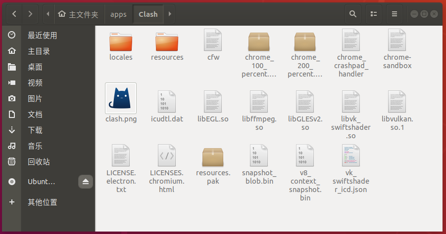
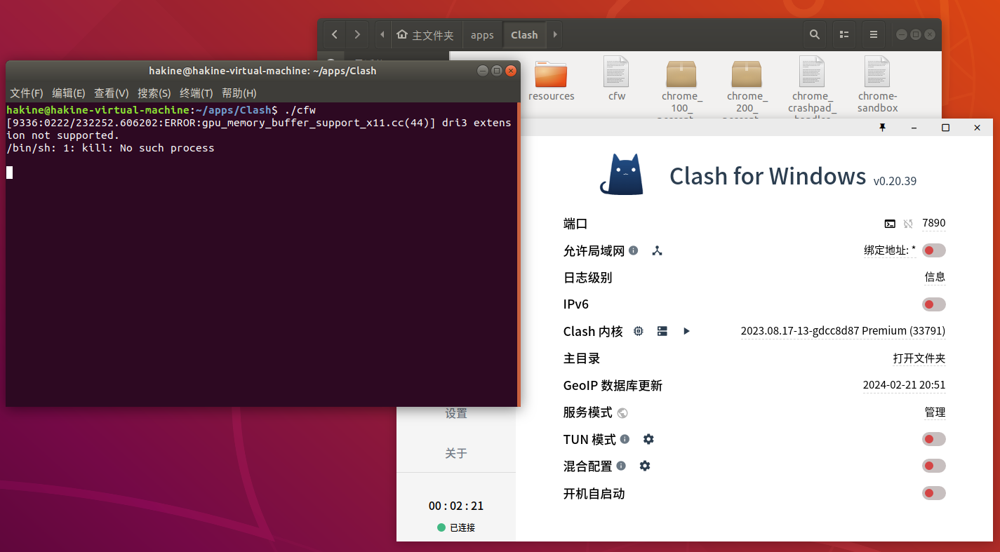
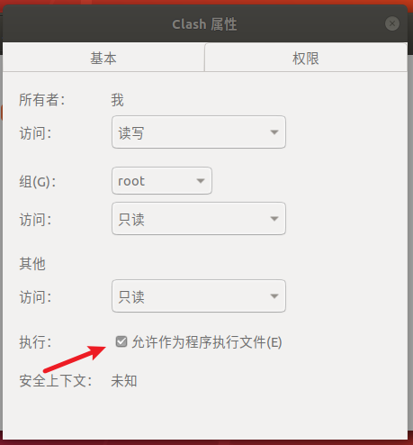

# Ubuntu安装cfw并创建桌面图标

cfw 软件全称 `clash for windows`，看到名字不要以为只能在 windows 上安装，它支持 `mac/linux/windows/android`。

本篇主要讲 cfw 这个软件如何加入 Ubuntu 的软件中心与创建桌面图标。

## 👀安装 cfw

**第零步**：创建文件夹用来存放cfw

```bash
mkdir ~/apps
```

**第一步**：前往下载[clash_for_windows_pkg](https://archive.org/download/clash_for_windows_pkg)，选择下图红框软件。


**第二步**：解压到 apps 文件夹，并重命名为 Clash

```bash
# 解压到 apps 文件夹内
tar -zxf Clash.for.Windows-0.20.39-x64-linux.tar.gz -C ~/apps
# 在 apps 文件夹内，将解压的文件夹重命名
mv 'Clash for Windows-0.20.39-x64-linux' Clash
```



**第三步**：进入目录运行 `./cfw` ，这就运行起来了，但不能退出终端，体验不好。



> 💡 不要在 root 下运行，会出现 `—no-sandbox` 的错误，找了好久也没找到解决办法，涉及 electron 和 chrome 相关的。

## 创建桌面图标

接下来主要开始介绍如何使 cfw 这个软件加入 Ubuntu 的软件中心。

1. 在 `/usr/share/applications` 下新建 `clash.desktop` 文件

```bash
cd /usr/share/applications
sudo touch clash.desktop
```

> 也可以在 `~/.local/share/applications` 下新建 `clash.desktop` 文件，同理下面都需要改动目录为 `~/.local/share/applications` 。

2. 编辑 `clash.desktop` 文件，添加以下内容，根据实际情况填写

```bash
# 编辑 clash.desktop 文件
sudo vim clash.desktop
```

添加以下内容：

```bash
[Desktop Entry]
Encoding=UTF-8
Type=Application
# 应用名称
Name=clash
# 图标路径；图片格式支持：svg png
Icon=/home/user/图片/APP.png
# 启动是否开启终端
Terminal=false
# 可执行文件路径
Exec=/home/user/apps/Clash/可执行文件
```

例如：

```bash
# 示例1
[Desktop Entry]  
Encoding=UTF-8  
Type=Application  
Name=Clash  
Icon=/home/hakine/apps/Clash/clash.png  
Terminal=false  
Exec=/home/hakine/apps/Clash/cfw

# 示例2
[Desktop Entry]
Name=clash for windows
Icon=/home/hakine/apps/Clash/clash.png  
Exec=/home/hakine/apps/Clash/cfw
Type=Application
```

> 重点解释：
>
> - Exec 代表刚才执行 `./cfw` 命令的路径。
>
> - Icon 图如下：
>
>   
>
> - ❗记得要把 Icon 图放在 Clash 文件夹内

3. 给当前用户添加可执行权限

```bash
sudo chmod u+x  /usr/share/applications/clash.desktop
```

4. 出现报错💢：`ubuntu无法执行该文件` ，可以使用 chown 命令更改 `clash.desktop` 文件的所有者

```bash
sudo chown hakine clash.desktop
```



5. 现在你可以把 `clash.desktop` 文件复制到其他需要的地方，完成！！！

## 参考链接

1. [**老苗：**2022 科学上网: Ubuntu & CFW 实现透明代理](https://laomiao.site/2022-%E7%A7%91%E5%AD%A6%E4%B8%8A%E7%BD%91-ubuntu-cfw-%E5%AE%9E%E7%8E%B0%E9%80%8F%E6%98%8E%E4%BB%A3%E7%90%86)
2. [**晓然**：Ubuntu安装cfw并创建桌面图标](https://www.xiaoran.de/posts/ubuntu-cfw)
3. [**chen**：怎么在Ubuntu桌面手动添加应用快捷方式](http://www.weituan.com/zixun/461993.html)
4. [**木子欢儿**：给你的AppImage创建桌面快捷方式](https://www.cnblogs.com/HGNET/p/16396589.html)
5. [clash_for_windows_pkg下载](https://archive.org/download/clash_for_windows_pkg)
6. [Clash中文网](https://clashcn.com/clash-for-windows)

>部分文章来源于网络，如疏漏未标注原文地址或侵权，请联系进行删除。
