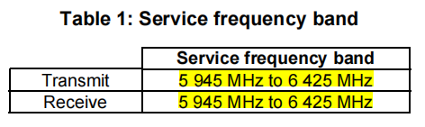

# EN 303 687 V1.1.1笔记

## 1. 使用范围

ETSI EN 303 687 V1.1.1 Scope：

本法规规定了包括无线电局域网(WAS/RLAN)设备在内的6 GHz无线接入系统的技术特性和测量方法，该无线电设备能够在表1中给出的全部或部分频段中运行。

**解读：**

EN 303 687的适用范围最关键的地方在于使用的频段，众所周知，Wi-Fi 6E一共有4个Band，分别是：

- Band 5：5925 ~ 6425 MHz；
- Band 6：6425 ~ 6525 MHz；
- Band 7：6525 ~ 6875 MHz；
- Band 8：6875 ~ 7125 MHz；

而**EN 303 687仅适用Band 5**，并且**起始频率是从5945 MHz开始**而不是5925 MHz，Band 6~8目前也还未开放。

---

## 2. 设备类别

ETSI EN 303 687 V1.1.1 定义了以下2种设备类别：

