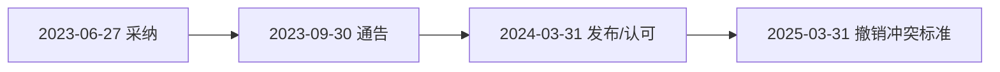

# 欧盟标准关键日期

ETSI EN 303 687 V1.1.1标准中关键日期如下：

| National transposition dates                                 |                   |
| :----------------------------------------------------------- | ----------------- |
| Date of adoption of this EN:                                 | 27 June 2023      |
| Date of latest announcement of this EN (doa):                | 30 September 2023 |
| Date of latest publication of new National Standard or endorsement of this EN (dop/e): | 31 March 2024     |
| Date of withdrawal of any conflicting National Standard (dow): | 31 March 2025     |

在欧盟标准化体系中，EN 303687标准中的几个日期分别代表以下关键节点：

### 📅 1. **Date of adoption: 2023年6月27日**

- **含义**：这是欧盟正式采纳该标准的日期。技术内容已最终确定并批准为欧洲标准（EN），标志着标准制定阶段的完成。

  > 这是欧洲标准被正式采用的日期，标志着技术内容最终确定并批准成为正式欧洲标准（EN）。

### 📣 2. **Date of latest announcement (doa): 2023年9月30日**

- **含义**：指标准被采纳后，欧盟向成员国**正式通告**的截止日期。成员国需开始准备将标准转化为国家标准，并规划后续步骤。

### 📖 3. **Date of publication/endorsement (dop/e): 2024年3月31日**

- **含义**：成员国需在此日期前完成以下任一操作：

  - 以国家标准形式**发布EN标准**（例如标注为"DIN EN 303687"）；
  - 或**正式认可**该EN标准为国家标准。此日期后，EN标准在成员国具有正式效力。

  > 这是新标准在国家层面正式发布的截止日期。欧盟成员国必须在这个日期之前以国家标准形式发布EN标准，或者正式认可该EN标准为国家标准。

### 🚫 4. **Date of withdrawal (dow): 2025年3月31日**

- **含义**：成员国必须**撤销所有与新标准冲突的国家标准**的截止日期。此后，任何与EN 303687冲突的旧国家标准均失效，仅新标准具有强制效力。

  > 这是成员国必须撤销所有与新标准冲突的国家标准的截止日期。在此日期之后，所有冲突的国家标准将失效。

---

### ⏳ **时间线总结**

这些日期体现了欧盟标准从采纳到强制实施的**分阶段过渡**逻辑，旨在确保成员国逐步统一技术规范，同时为行业适应提供缓冲期。EN 303 687作为技术规范（如涉及通信设备或能效要求），其时间节点对制造商、检测机构及市场监管部门均有约束力。

